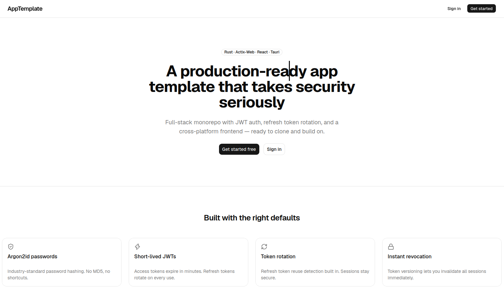
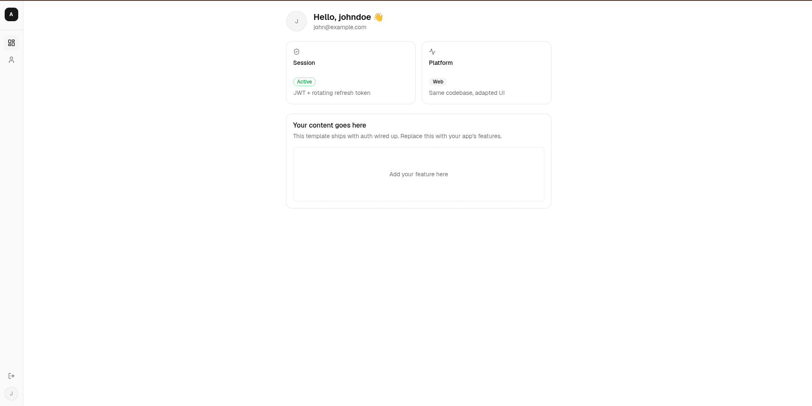
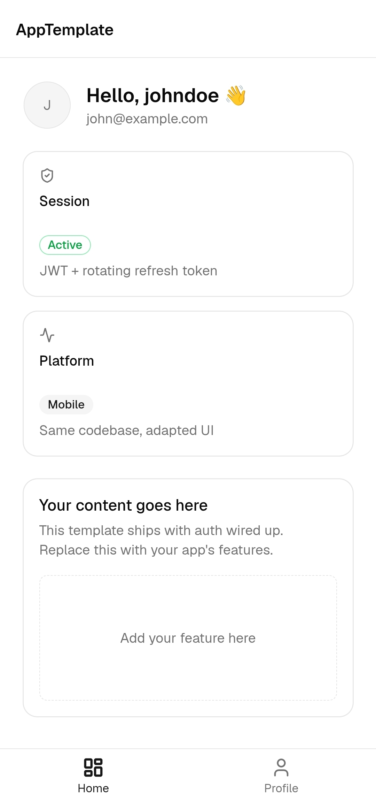
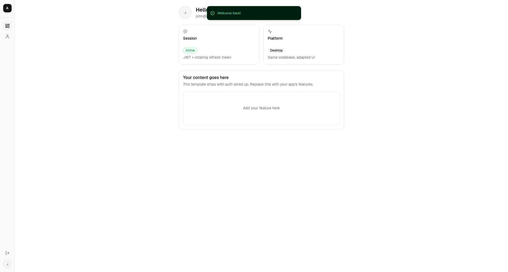

# rs_jwt_microservice

<div align="center">
  
</div>

A production-ready REST API microservice template built with Rust's Actix Web framework. Comes with JWT authentication, user management, and PostgreSQL integration out of the box — a solid starting point for building scalable web applications.

## Monorepo Structure

```
rs_jwt_microservice/
  backend/      # Actix-Web REST API (Rust)
  database/     # SeaORM entities and migrations (Rust)
  frontend/     # Tauri + React desktop/mobile app (TypeScript)
```

## Features

- JWT authentication — access and refresh tokens
- User registration, login, and profile management
- Argon2 password hashing
- PostgreSQL integration via SeaORM
- Automated schema management with migrations
- Environment-based configuration
- Configurable structured logging

## Tech Stack

| Layer | Technology |
|---|---|
| Desktop / mobile shell | Tauri |
| Frontend | React + TypeScript |
| Backend | Actix-Web 4.13.0 (Rust) |
| Database | PostgreSQL + SeaORM 1.1.19 |
| Auth | JWT 10.3.0 + Argon2 0.5.3 |

## Getting Started

See the README in each workspace folder for setup instructions:

- [backend/README.md](backend/README.md)
- [database/README.md](database/README.md)
- [frontend/README.md](frontend/README.md)

## License

Licensed under either [MIT](LICENSE-MIT) or [Apache-2.0](LICENSE-APACHE) at your option.

## Author

**jvcByte** - [jvc8463@gmail.com](mailto:jvc8463@gmail.com)

## Platform UI
### Web

<div align="center">
  
</div>

### Mobile

<div align="center">
  
</div>

### Desktop

<div align="center">
  
</div>
